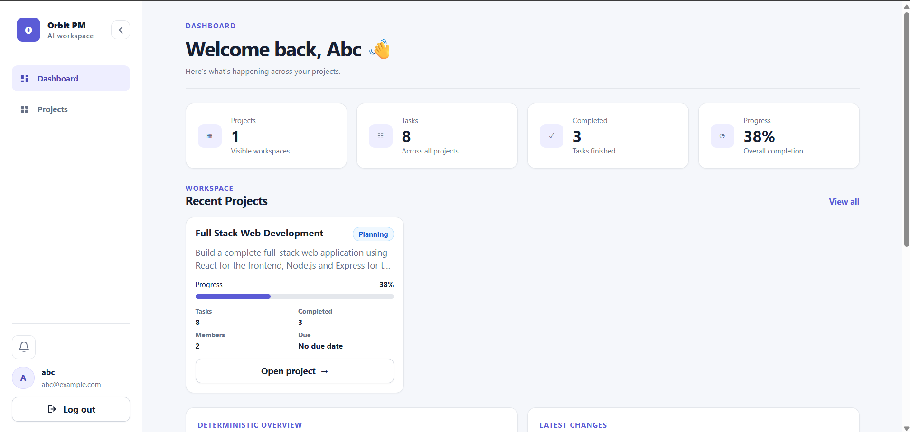
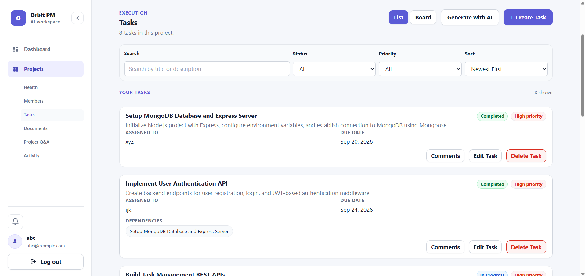
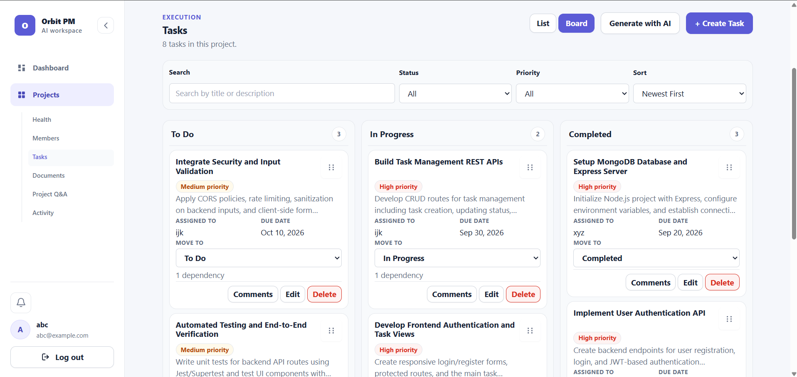
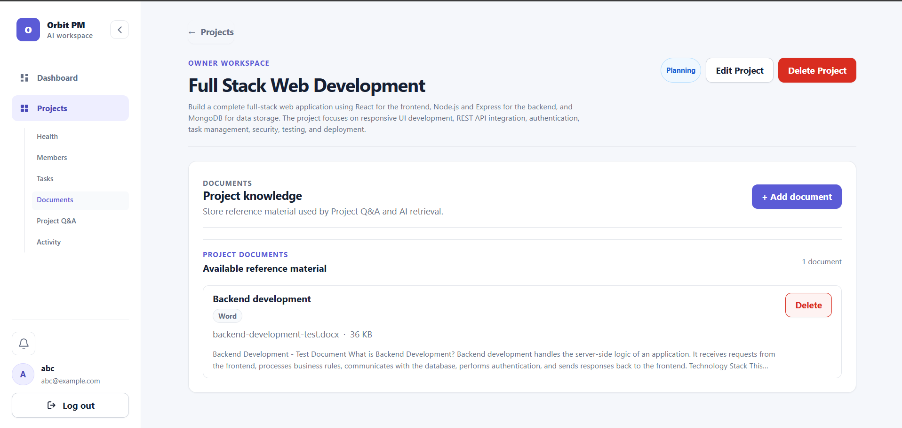
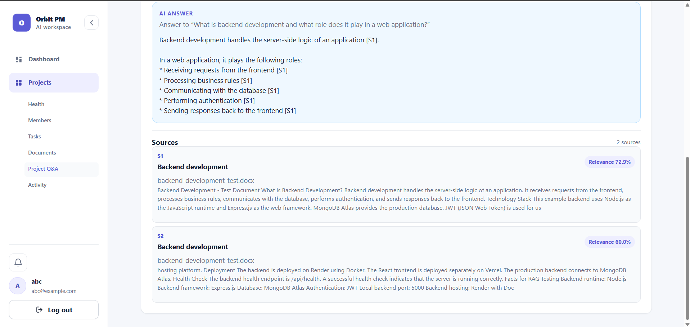
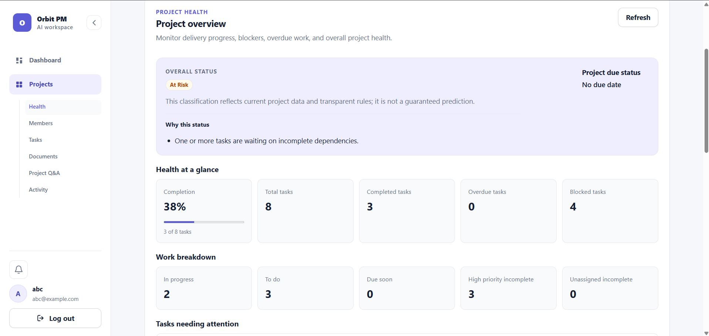
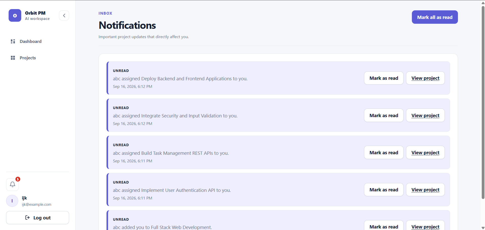
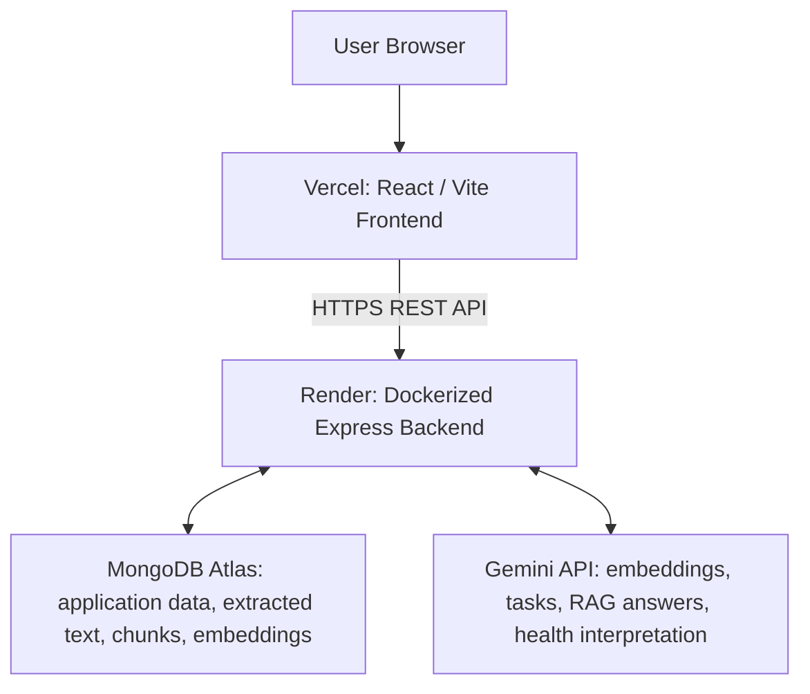

# Orbit PM — AI-Powered Project Management

Orbit PM is a deployed full-stack collaborative project-management SaaS that brings projects, tasks, and team knowledge into one workspace. Teams can plan work in List and Kanban views, manage members, assignments and dependencies, discuss tasks, follow activity and notifications, and use document-grounded AI assistance.

Gemini powers document Q&A, task generation, and optional interpretation of deterministic project-health metrics. The repository is named `ai-project-management-saas`.

## Screenshots

### Dashboard

Workspace overview showing projects, task totals, completion progress, members, and recent project information.



### Task Management

List view with search, filtering, sorting, priorities, assignments, due dates, dependencies, comments, and task controls.



### Kanban Board

Three-column workflow for To Do, In Progress, and Completed tasks with persisted status changes.



### Document Knowledge

Project document workspace supporting uploaded reference material for AI retrieval and Q&A.



### Document-Grounded Project Q&A

RAG-powered Q&A with an AI answer, source labels, retrieved document excerpts, and similarity-based relevance information.



### Deterministic Project Health

Rule-based project health showing completion, blocked work, overdue work, priorities, and other project metrics.



### Notifications

Recipient-specific notifications with unread state, task/member events, navigation, and read controls.



## Key Features

| Area | Implemented functionality |
| --- | --- |
| Authentication | Registration, login, session restoration, logout, and protected routes |
| Projects | Create, edit, and delete projects; manage lifecycle status, dates, and registered-user membership |
| Tasks | Permission-aware creation, editing and deletion; priorities, due dates, member assignments, and dependencies |
| List and Kanban | Search, filtering, sorting, and persisted drag-and-drop status changes |
| Collaboration | Task comments, author editing, owner moderation, and project activity history |
| Notifications | In-app membership, assignment, unassignment, and assigned-task status events; unread counts and read controls |
| Documents | Pasted text and TXT/PDF/DOCX uploads with extraction and metadata |
| AI assistance | Document-grounded Q&A, validated task generation, and optional project-health interpretation |
| Project Health | Deterministic completion, schedule, overdue, priority, assignment, and dependency metrics |
| Interface | Responsive layouts, reusable workspace components, and loading, empty, and error states |

## AI Capabilities & Document Q&A

### Document-grounded Q&A

The backend implements retrieval-augmented generation (RAG) over documents belonging to the selected project:

```text
Document
  → extraction and normalization
  → structure-aware chunking
  → Gemini embeddings
  → chunks and embeddings stored in MongoDB

Question
  → Gemini question embedding
  → application-side cosine similarity against project chunks
  → relevance filtering, deduplication, and source diversity
  → selected context supplied to Gemini
  → answer with source metadata and citation labels
```

Chunking prefers paragraph, line, sentence, and word boundaries. PDF page information is retained when available, allowing sources to include page references.

| Retrieval setting | Current default |
| --- | --- |
| Chunk size / overlap | 1,000 / 200 characters |
| Minimum cosine similarity | 0.2 |
| Candidate limit / final source limit | 8 / 5 |
| Selected context budget | 5,000 characters |

Embeddings are numeric arrays stored in ordinary MongoDB documents. **There is no dedicated vector database or Atlas Vector Search integration; similarity ranking runs in backend application code.**

Answers include source labels such as `[S1]`, with document titles, excerpts, and available file/page metadata. Unknown citation IDs are rejected. Relevance scores represent similarity, not calibrated confidence, and valid citations do not guarantee semantic correctness. When retrieval finds no relevant context, the application returns a no-information response.

### AI task generation

Gemini uses the project's name and description to generate 5–10 structured tasks with priorities, due dates, and dependency references. The backend validates the response, rejects invalid references, self-dependencies and cycles, then maps temporary task IDs to database IDs. Validated tasks and their dependencies are persisted transactionally, together with an activity entry.

### Project Health and AI Health Insight

**Deterministic Project Health** calculates completion, overdue and due-soon work, priorities, unassigned tasks, blocked dependencies, and schedule status. Its classifications are `healthy`, `at_risk`, `critical`, and `insufficient_data`.

**AI Health Insight** interprets those already calculated metrics and returns a summary, key concerns, and suggested actions. It does not determine the authoritative classification or automatically modify project data. It is an optional layer whose availability depends on the external AI provider.

### Document ingestion

- TXT, text-based PDF, and DOCX files are supported, with a **5 MB maximum upload size**.
- Multer uses memory storage; PDF extraction uses `pdf-parse`, DOCX extraction uses Mammoth, and TXT decoding validates UTF-8 text.
- Validation checks extension/MIME combinations, file signatures where applicable, size, and extracted content. Invalid, protected, empty, or unsupported files receive safe errors.
- Extracted text is limited to **100,000 characters**, with a separate **25-chunk embedding workload limit**. A file under 5 MB can still exceed these content/workload limits.
- MongoDB stores extracted content, metadata, chunks, and embeddings. **Original uploaded bytes are not persisted.**
- There is no OCR pipeline; image-only PDFs cannot be indexed as text.

## Architecture



The backend communicates independently with Atlas and Gemini. MongoDB does not call the AI provider. Project-scoped authorization is enforced by the backend before protected operations.

## Technology Stack

Dependency versions below are resolved from the audited lockfiles. Node 24.x is the runtime major used by Docker and CI.

| Layer | Technologies |
| --- | --- |
| Frontend | React 19.2.8, Vite 8.2.2, React Router DOM 7.18.2, Axios 1.20.0, `@dnd-kit/react` 0.5.0 |
| UI architecture | JavaScript/JSX, React contexts and feature hooks, reusable components, custom responsive CSS |
| Backend | Node.js 24.x, Express 4.22.2, Mongoose 8.24.3 |
| Authentication | `jsonwebtoken` 9.0.3, bcrypt 6.0.0 |
| HTTP safeguards | Helmet 8.3.0, express-rate-limit 8.7.0 |
| AI and documents | `@google/genai` 2.18.0, Multer 2.3.0, pdf-parse 2.4.5, Mammoth 1.12.2 |
| Backend testing | Jest 30.5.1, Supertest 7.2.2 |
| Frontend testing | Vitest 5.0.0, jsdom 29.1.1, Testing Library React 16.3.3, jest-dom 7.0.1 |
| Infrastructure | Docker, GitHub Actions, Render, Vercel, MongoDB Atlas |

## Collaboration & Permissions

Roles are scoped to each project, rather than global administrator roles.

| Action | Owner | Member |
| --- | --- | --- |
| View project, tasks, members, documents, and activity | Yes | Yes |
| Edit/delete project and manage membership | Yes | No |
| Create/update tasks and move task status | Yes | Yes |
| Delete tasks | Yes | No |
| Create/upload/edit/delete documents | Yes | No |
| Use Q&A, AI task generation, health, and AI insight | Yes | Yes |
| Read/create task comments | Yes | Yes |
| Edit comments | Own comments only | Own comments only |
| Delete comments | Any project comment | Own comments only |

Members must already have registered accounts and are added by email. Task assignees must belong to the project's member list; the owner is not automatically an eligible assignee. Dependencies must reference tasks in the same project and cannot form cycles.

Activity history records supported project, task, membership, document, and AI task-generation events. Notifications are recipient-scoped and suppress self-notifications; comments do not currently generate notification events.

Related multi-record mutations use MongoDB transactions. Project deletion cleans up associated records; task deletion removes comments and dependency references; document deletion removes its chunks.

## Security & Reliability

The application includes practical safeguards, without claiming complete security or guaranteed AI correctness:

- JWT Bearer authentication, token-expiration handling, and bcrypt password hashing with cost factor 10.
- Backend owner/member authorization checks and recipient-scoped notification access.
- Helmet and CORS restricted to the configured frontend origin; requests without an Origin header are also permitted.
- A **1 MB** JSON/URL-encoded request-body limit.
- Authentication rate limiting: **20 requests per 15 minutes**, keyed by client IP.
- AI rate limiting: **30 requests per 15 minutes**, primarily keyed by authenticated user ID.
- Endpoint/schema validation, assignment and dependency checks, and document type/signature/size validation.
- Validation of structured AI responses, embeddings, and returned citation IDs.
- Environment-based backend secrets, excluded from Git and the Docker build context.

Gemini calls use at most **two attempts**, a default **20-second attempt timeout**, and a **45-second operation budget**, with abort signals and bounded retry delays. Temporary provider/network errors can be retried; confirmed daily quota exhaustion, configuration failures, and invalid responses are not blindly retried. Safe errors are returned to the UI, and provider retries are separated from database persistence.

These budgets apply to individual wrapped provider operations, not an entire multi-chunk upload. Prompt instructions and output validation improve reliability but do not provide prompt-injection immunity.

## Testing

The latest completed repository audit verified:

| Suite | Passing tests | Organization |
| --- | --- | --- |
| Backend | **177 / 177** | 14 Jest suites |
| Frontend | **129 / 129** | 19 Vitest test files |

Backend Jest/Supertest tests cover authorization, API behavior, task validation, comments, activity, notifications, document extraction, RAG retrieval, health calculations, transactions/rollback behavior, and Gemini reliability. External database/provider behavior is mocked in the automated suites.

Frontend Vitest/jsdom/Testing Library tests cover authentication and session behavior, project workflows, permissions, List/Kanban interactions, documents, comments, notifications, activity, health, and source display. The document-upload regression exercises **real Axios transformation with mocked transport for TXT, PDF, and DOCX**, ensuring multipart files are not serialized as JSON.

```bash
# Repository root: backend tests
npm test

# Frontend checks
cd frontend
npm test
npm run lint
npm run build
```

No test-coverage percentage is claimed. Automated tests and production smoke tests serve different purposes.

## CI/CD & Deployment

### GitHub Actions: validation

The [CI workflow](.github/workflows/ci.yml) runs on pushes to `main` and pull requests targeting `main`. Three independent jobs can run in parallel:

| Job | Validation |
| --- | --- |
| `backend-tests` | Set up Node 24, install with `npm ci`, run backend tests |
| `frontend-checks` | Set up Node 24, install with `npm ci` using the frontend lockfile, run tests, lint, and production build |
| `docker-build` | Build the backend image with the CI-only tag; no container startup or registry push |

Jobs use Ubuntu 24.04, official checkout/setup-node actions, read-only repository permissions, and 15-minute timeouts. Node jobs cache npm dependencies using their respective lockfiles. Production secrets are not required.

### Hosting: deployment

| Component | Production host |
| --- | --- |
| React/Vite frontend | Vercel |
| Dockerized Express backend | Render |
| Database | MongoDB Atlas |
| AI provider | Google Gemini |

Render backend auto-deployment and Vercel Git deployment are enabled, as confirmed by the project owner. **GitHub Actions performs validation, not deployment.** This repository does not establish that hosting deployments wait for CI success.

The frontend project root is `frontend`, with Vite output in `dist`. [frontend/vercel.json](frontend/vercel.json) provides the SPA fallback for direct navigation and refreshes on React Router routes. Render uses the existing repository-root Dockerfile and an externally supplied port.

The backend health endpoint is **`GET /api/health`**. Startup connects to MongoDB before listening; the health response reports HTTP availability rather than continuous database readiness.

Production smoke tests confirmed the main authentication, project/task, collaboration, upload, RAG, AI task-generation, deterministic health, and responsive-UI flows. AI Health Insight remains dependent on Gemini availability; it is not represented here as a successfully completed production smoke-test result.

## Local Development

### Prerequisites

- Node.js 24.x and npm.
- MongoDB Atlas access, or another MongoDB configuration that supports transactions. A standalone non-replica-set database is not an equivalent setup.
- Gemini API access for AI features and document embedding.
- Docker Desktop with Linux containers only if using the Docker workflow.

### Backend

From the repository root:

```bash
npm ci
```

**Before starting the server**, create a local `.env` from `.env.example` and configure the required settings privately. Do not overwrite an existing configured `.env`.

```bash
# macOS/Linux: run only when .env does not already exist
cp .env.example .env
```

```powershell
# Windows PowerShell: run only when .env does not already exist
Copy-Item .env.example .env
```

After configuring the environment, start the backend:

```bash
npm run dev
```

The backend defaults to local port **5000** and serves API routes under `/api`. Use `npm start` to run without nodemon. Atlas network access must allow the development machine's connection.

### Frontend

In a separate terminal, from the repository root:

```bash
cd frontend
npm ci
```

Create `frontend/.env` from `frontend/.env.example`, using the same copy procedure from inside `frontend`. Configure the public API base URL to point to the backend and include its `/api` prefix, then start Vite:

```bash
npm run dev
```

Use the URL printed by Vite and ensure the backend's configured frontend origin matches it. Frontend environment settings are embedded at build time; rebuild after changing them for production.

On Windows, use `npm.cmd` if PowerShell execution policy prevents running `npm.ps1`. `npm run build` creates the frontend production output; `npm run preview` serves a local preview of that build.

## Environment Variables

Keep real values in local untracked files or hosting environment settings. The lists below contain names only; use the existing example files as configuration templates.

| Backend | Frontend |
| --- | --- |
| `MONGODB_URI` | `VITE_API_URL` |
| `JWT_SECRET` | |
| `JWT_EXPIRES_IN` | |
| `GEMINI_API_KEY` | |
| `GEMINI_MODEL` | |
| `EMBEDDING_MODEL` | |
| `FRONTEND_ORIGIN` | |
| `PORT` | |
| `NODE_ENV` | |

**Never expose backend secrets through `VITE_` variables.** Vite-prefixed variables are browser-visible. Do not commit real `.env` files or copy them into a Docker image.

## Docker Usage

From the repository root:

```bash
docker build -t ai-project-management-backend:local .
docker run -d --name ai-pm-backend-local --env-file .env -e NODE_ENV=production -e PORT=5000 -p 127.0.0.1:5000:5000 ai-project-management-backend:local
```

Configure the local environment file first, using Docker-compatible env-file syntax without shell expansion or surrounding quotes. The example binds the published port to localhost. Stop a separately running backend on that port before starting the container.

```bash
docker stop ai-pm-backend-local
docker rm ai-pm-backend-local
```

The image uses `node:24-bookworm-slim`, installs locked production dependencies with `npm ci --omit=dev`, cleans the npm cache, and runs as the non-root `node` user. `.dockerignore` restricts the build context to backend runtime inputs and excludes environment files and local artifacts.

The image contains **only the backend**. MongoDB Atlas remains external, and Vercel hosts the frontend separately. No Docker Compose setup is currently required.

## Project Structure

```text
ai-project-management-saas/
├── .github/workflows/ci.yml
├── src/
│   ├── config/
│   ├── constants/
│   ├── controllers/
│   ├── middleware/
│   ├── models/
│   ├── routes/
│   ├── services/
│   ├── utils/
│   ├── app.js
│   └── server.js
├── tests/
├── frontend/
│   ├── public/
│   ├── src/
│   │   ├── components/
│   │   ├── context/
│   │   ├── features/
│   │   ├── hooks/
│   │   ├── pages/
│   │   ├── services/
│   │   ├── styles/
│   │   ├── test/
│   │   └── utils/
│   ├── .env.example
│   ├── package.json
│   ├── package-lock.json
│   ├── vercel.json
│   └── vite.config.js
├── .env.example
├── .dockerignore
├── Dockerfile
├── jest.config.js
├── package.json
├── package-lock.json
└── README.md
```

## Future Scope

Orbit PM currently focuses on a reliable full-stack project-management workflow with document-grounded AI. Future enhancements could include scalable vector retrieval, real-time notifications, OCR support for image-based and scanned documents, distributed rate limiting, and enhanced session management.

## Project Context

Orbit PM is a full-stack AI project built to explore practical project-management workflows, document retrieval, reliable AI integration, authorization, automated testing, Docker, CI/CD, and production deployment. It connects those concerns in a working application with explicit implementation limits and a documented path for further development.
